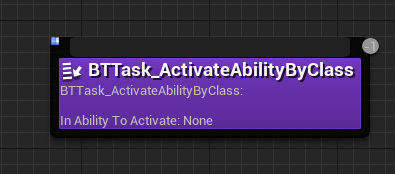
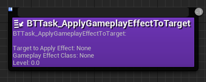

In Common GAS, you can choose to either use ``StateTree`` or the standard ``AIModule`` when it comes to build an AI system.
I already provided you with some helpful ``Decorators``and ``Tasks`` if you using the standard AIModule but if you're using ``StateTree``, we dont provided any decorators and tasks as i havent battle tested StateTree enough but in the future, maybe i will provided some so you can still build your ai logic with ``StatetTree``

In this example, im going to show you the basic setup to get you going.

## Setup

- By Default, CommonGAS already enabled ``AIModule`` ,``StateTree`` and ``GameplayStateTree`` if you're planning to use that plugin and added them as dependecies. 

- For any AI-controlled characters, they need to inherit from ``CommonModularPawn`` and ``CommonAIPawnWithStateTree`` if you're planning to use StateTree

- Next, you need to make an ``AIController`` inherit from ``CommonModularAIController`` to control the AI.

- In the blueprint graph, on ``BeginPlay`` we simply call the ``Run Behaviour Tree`` and apply your behaviour tree asset.

- Lastly, in your ``pawn`` class class default, find ``Pawn->Ai Controller Class`` and set your AIController to the one we created.

Now, thats the basic setup that should get you going. Have fun building your AIs!

## Tasks

In Common GAS, i have provided you with some useful ``Tasks`` you can use with GAS to build your gameplay logic:

# BTTask_ActivateAbilityByClass

# BTTask_ActivateAbilityByTags

# BTTask_ActivateAbilityOnce

# BTTask_AddLooseGameplayTag

# BTTask_AddLooseGameplayTags

# BTTask_ApplyGameplayEffectToSelf

# BTTask_ApplyGameplayEffectToTarget

# BTTask_RemoveLoooseGameplayTags

# BTTask_RemoveLooseGameplayTag

# BTTask_SendGameplayEvent

## Decorators

In Common GAS, i have provided you with some useful ``Decorators`` you can use with GAS to build your gameplay logic:

# BTDecorator_HasAllGameplayTags

# BTDecorator_HasAnyMatchingGameplayTags

# BTDecorator_HasMatchingGameplayTag

# BTDecorator_IsAbilitySystemComponentValid

