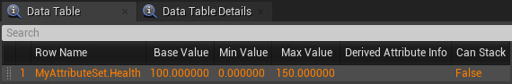
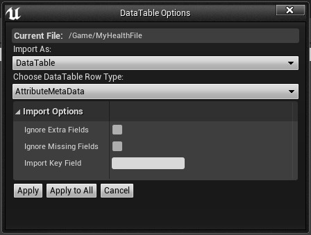
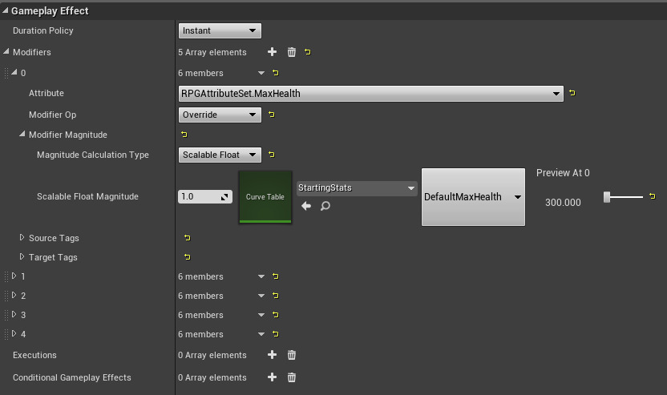
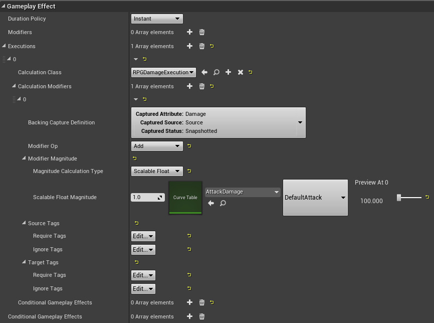

The Gameplay Ability System uses Gameplay Attributes (FGameplayAttribute) to store, calculate, and modify gameplay-related floating-point values. These values can describe any trait of their owners, such as a character's remaining health points, a vehicle's top speed, or the number of times an item can be used before it breaks. Actors in the Gameplay Ability System store their Gameplay Attributes in an Attribute Set, which helps to manage interactions between Gameplay Attributes and other parts of the system, and registers itself with the Actor's Ability System Component. These interactions include clamping to value ranges, performing calculations that apply temporary value changes, and reacting to events that permanently alter their base values.(taken from Epic’s Documentation)
Attribute Set Gameplay Events ( Coming Soon)

## Adding New Attribute

Taken from : [Official Documentation](https://docs.unrealengine.com/5.1/en-US/gameplay-attributes-and-attribute-sets-for-the-gameplay-ability-system-in-unreal-engine/)


Extend the base Attribute Set class, UAttributeSet, and add your Gameplay Attributes as FGameplayAttributeData UProperties. A simple Attribute Set with one Gameplay Attribute might look like this:

```
GENERATED_BODY()

public:
/** Sample "Health" Attribute, publicly accessible */
UPROPERTY(EditAnywhere, BlueprintReadOnly)
FGameplayAttributeData Health;
```

Store the Attribute Set on the Actor, and expose it to the engine. Use the const keyword to ensure that code cannot modify the Attribute Set directly. Add this to your Actor's class definition:

```
/** Sample Attribute Set. */ UPROPERTY() const UMyAttributeSet* AttributeSet;
```


Register the Attribute Set with the appropriate Ability System Component. This happens automatically when you instantiate the Attribute Set, which you can do in the Actor's constructor, or during BeginPlay, as long as the Actor's GetAbilitySystemComponent function returns a valid Ability System Component at the moment of instantiation. You can also edit the Actor's Blueprint and add the Attribute Set type to the Ability System Component's Default Starting Data. A third method is to instruct the Ability System Component to instantiate the Attribute Set, which will then register it automatically, as in this example: 

```
// Get the UMyAttributeSet from our Ability System Component. The Ability System Component will create and register one if needed.
AttributeSet = ASC->GetSet<UMyAttributeSet>();

// We now have a pointer to the new UMyAttributeSet that we can use later. If it has an initialization function, this is a good place to call it.
```

After adding these, your Attribute Set class definition should look like this: 

```
UCLASS()
class MYPROJECT_API UMyAttributeSet : public UCommonAttributeSet
{
    GENERATED_BODY()

    protected:
    /** Sample "Health" Attribute */
    UPROPERTY(EditAnywhere, BlueprintReadOnly)
    FGameplayAttributeData Health;

    //~ ... Other Gameplay Attributes here ...

    public:
    //~ Helper functions for "Health" attributes
    GAMEPLAYATTRIBUTE_PROPERTY_GETTER(UMyAttributeSet, Health);
    GAMEPLAYATTRIBUTE_VALUE_GETTER(Health);
    GAMEPLAYATTRIBUTE_VALUE_SETTER(Health);
    GAMEPLAYATTRIBUTE_VALUE_INITTER(Health);

    //~ ... Helper functions for other Gameplay Attributes here ...
};
```

## Initialization

Taken from : [Official Documentation](https://docs.unrealengine.com/5.1/en-US/gameplay-attributes-and-attribute-sets-for-the-gameplay-ability-system-in-unreal-engine/)

If you choose not to initialize your Attribute Set and its Gameplay Attributes by calling an initialization function with hard-coded values, you can do so with a Data Table using the Gameplay Ability System row type called "AttributeMetaData". You can import data from an external file, or manually populate the Data Table in the editor. 



``When creating the Data Table Asset, choose "AttributeMetaData" as the row type.``

``Importing Data Tables``

Developers usually import their tables from .csv files like the following:

```
---,BaseValue,MinValue,MaxValue,DerivedAttributeInfo,bCanStack
MyAttributeSet.Health,"100.000000","0.000000","150.000000","","False"
```



``When importing a .csv file as a Data Table Asset, select the "AttributeMetaData" row type.``

You can append additional rows to support Attribute Sets with multiple Gameplay Attributes. In the file shown above, the "Health" Gameplay Attribute within UMyAttributeSet (the reflection system drops the "U" prefix) will initialize with a value of 100. It has no derived information and does not stack.

Note:
```
Although there are columns for MinValue (0.0) and MaxValue (150.0), Gameplay Attributes and Attribute Sets do not feature a built-in clamping behavior; the values in these columns have no effect.
```

``Manually Populating Data Tables``


If you prefer to edit values in Unreal Editor rather than an external spreadsheet or text-editor program, you can do so by creating your table and opening it like any other Blueprint Asset. Use the Add button at the top of the window to add a row for each Gameplay Attribute. Keep in mind that the naming convention is AttributeSetName.AttributeName, and it is case-sensitive.

Note:
```
The "Min Value" and "Max Value" columns are not implemented in the default Gameplay Ability System Plugin; these values do not have any effect.
```

``Controlling Gameplay Attribute Access``

Controlling direct access to the Gameplay Attributes is a good way to ensure that their values are always within the limits that you set for them. This is done through the Ability Set, not by extending ``FGameplayAttributeData``; ``FGameplayAttributeData`` only stores and provides access to the Gameplay Attribute's data.

To restrict the value of the "Health" Gameplay Attribute so that it can never go below zero, you can write your own getter and setter functions. Remove the ``GAMEPLAYATTRIBUTE_VALUE_GETTER`` and ``GAMEPLAYATTRIBUTE_VALUE_SETTER`` macros, replacing them with function headers:

```
GAMEPLAYATTRIBUTE_PROPERTY_GETTER(UMyAttributeSet, Health);
float GetHealth() const;
void SetHealth(float NewVal);
GAMEPLAYATTRIBUTE_VALUE_INITTER(Health);
```

Define these functions in your Attribute Set's source file:
```
float UMyAttributeSet::GetHealth() const
{
    // Return Health's current value, but never return a value lower than zero.
    // This is the value after all modifiers that affect Health have been considered.
    return FMath::Max(Health.GetCurrentValue(), 0.0f);
}

void UMyAttributeSet::SetHealth(float NewVal)
{
    // Do not accept values lower than zero.
    NewVal = FMath::Max(NewVal, 0.0f);

    // Make sure we have an Ability System Component instance. This should always be the case.
    UAbilitySystemComponent* ASC = GetOwningAbilitySystemComponent();
    if (ensure(ASC))
    {
        // Set the base value (not the current value) through the appropriate function.
        // This makes sure that any modifiers we have applied will still work properly.
        ASC->SetNumericAttributeBase(GetHealthAttribute(), NewVal);
    }
}

AbilitySystemComponent->GetGameplayAttributeValueChangeDelegate(AttributeSet->GetHealthAttribute()).AddUObject(this, &AGASAbilityDemoCharacter::OnHealthChangedInternal);
```

``Interactions with Gameplay Effects``

A common way to exercise control over the value of a Gameplay Attribute is to handle [Gameplay Effects] as they relate to it.

  Begin by overriding the PostGameplayEffectExecute function in your Attribute Set's class definition. This function should be at the public access level.

``void PostGameplayEffectExecute(const struct FGameplayEffectModCallbackData& Data) override;``

  Write the function body in the Attribute Set's source file, making sure to call the parent class' implementation.

```
// Remember to call the parent's implementation.
Super::PostGameplayEffectExecute(Data);

// Check to see if this call affects our Health by using the Property Getter.
if (Data.EvaluatedData.Attribute == GetHealthAttribute())
{
    // This Gameplay Effect is changing Health. Apply it, but restrict the value first.
    // In this case, Health's base value must be non-negative.
    SetHealth(FMath::Max(GetHealth(), 0.0f));
}
```


``Replication``

For multiplayer projects, you can replicate your Gameplay Attribute through the Attribute Set similar to how you would replicate any other property.

Begin by adding the ReplicatedUsing Specifier to your property's definition in the Attribute Set header file. This will set up a callback function that helps with prediction on remote systems.

```
protected: 
/** Sample "Health" Attribute */ 
(EditAnywhere, BlueprintReadOnly, ReplicatedUsing = OnRep_Health) FGameplayAttributeData Health;
```

Declare your replication callback function:
``
/** Called when a new Health value arrives over the network */
 UFUNCTION() virtual void OnRep_Health(const FGameplayAttributeData& OldHealth);
``

In the Attribute Set's source file, define your replication callback function. The body of the function can be expressed as a single macro that the Gameplay Ability System defines.

```
// Use the default Gameplay Attribute System repnotify behavior.
    GAMEPLAYATTRIBUTE_REPNOTIFY(UMyAttributeSet, Health, OldHealth);
```

If this is the first replicated property in your Attribute Set, set up an override for the public GetLifetimeReplicatedProps function.

```
 /** Marks the properties we wish to replicate */ 
 virtual void GetLifetimeReplicatedProps(TArray& OutLifetimeProps) const override;
```

If this is the first replicated property in your Attribute Set, set up an override for the public GetLifetimeReplicatedProps function.
```
/** Marks the properties we wish to replicate */ 
virtual void GetLifetimeReplicatedProps(TArray& OutLifetimeProps) const override;
```

Add the Gameplay Attribute to the Attribute Set's GetLifetimeReplicatedProps function in its source file, as follows:

```
// Call the parent function.
    Super::GetLifetimeReplicatedProps(OutLifetimeProps);

    // Add replication for Health.
    DOREPLIFETIME_CONDITION_NOTIFY(UMyAttributeSet, Health, COND_None, REPNOTIFY_Always);
```

## How Does Attribute Work?

Each of these attributes is defined as an FGameplayAttributeData structure, which stores a Base value that is only modified by permanent changes and a Current value which is modified by temporary buffs/debuffs. The class uses some macros to add boilerplate code to handle modification and replication of these attributes. 

1. Before attributes are modified, the PreAttributeChange function handles scaling the current health/mana with the max value. 

2. After attributes are modified, the PostGameplayEffectExecute function handles clamping and notifying other objects about the changes. 

``How Damage is handled in Action RPG Game Sample``

[ActionRPG](https://docs.unrealengine.com/4.27/en-US/Resources/SampleGames/ARPG/)

Before damage can be applied, a character needs to have Health > 0. There are several ways to initialize default values for attributes, but for ARPG we decided to initialize them using a Stats GameplayEffect. 

The Stats gameplay effect is applied in  ``ARPGCharacterBase::AddStartupGameplayAbilities`` where it reads the list of PassiveGameplayEffects from the character Blueprint and applies them, at the current CharacterLevel. 

Note:

``
In CommonGAS, this functionality is being replaced by UCommonAbilitySet.Its provides the same functionality but using data asset,programmer/designer doesnt have to manually adding them but just give this data asset to character and it automatically applied.
``

If CharacterLevel changes, it removes and re-adds them at the new level. Here is what the GE_StatsBase gameplay effect used for NPCs looks like inside the Unreal Engine 4 (UE4) editor: 



The Instant duration means that this is applied permanently precisely one time. Then for each of the primary stats, there is an Attribute Modifier that overrides the value based on a CurveTable. StartingStats is imported from a CSV in Abilities/DataTables and has a row for each stat and a column for each level. In this case, it will look at the DefaultMaxHealth row, and the column will be CharacterLevel. The GE_PlayerStats effect inherits from this generic effect and changes all the rows to be PlayerMaxHealth and so forth. By using Curve Tables in this way, it is easy to rebalance attributes for the entire game at once, without having to modify each individual effect by hand. You can also set up scripts outside the game to create CSV or JSON files from external data sources like Excel and import those as needed.

Mana is changed using simple Modifiers with the Add operation, but to do damage, the RPGDamageExecution class is used. The execution calculations consist of two parts, a set of capture declarations and an execution function. The capture declaration macros register information with the UE4 Editor, so Gameplay Effects can use the execution in your project. For each captured attribute, the list of currently active temporary modifiers is captured along with their gameplay tags. Then in URPGDamageExecution::Execute_Implementation it applies only those modifiers that match the Gameplay Tags that were passed in at effect execution time. After combining those modifiers to get a "calculated" number for Damage, AttackPower, and DefensePower, it turns that into "final" damage using the formula SourceDamage * AttackPower / DefensePower. The final damage then turns into a Health modifier in URPGAttributeSet::PostGameplayEffectExecute. Here is what GE_DamageBase looks like:



The Damage done comes from the DefaultAttack row in AttackDamage, but you can also apply a per-attack multiplier by changing the 1.0 scale to the left of the Curve Table reference. The Source/Target tags allow setting the Require/Ignore tags for filtering, in this case, the damage will not be applied if the target has the tag Status.DamageImmune. Each individual attack subclasses GE_DamageBase and modifies the tags or modifiers as needed.

Note:
``
In the future, CommonGAS with have damage and healing functionality similiar to how ActionRPG does.
``

Taken from : [Official Documentation](https://docs.unrealengine.com/4.27/en-US/Resources/SampleGames/ARPG/GameplayAbilitiesinActionRPG/AttributesandEffects/)