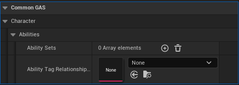
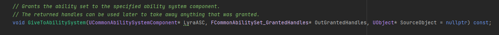
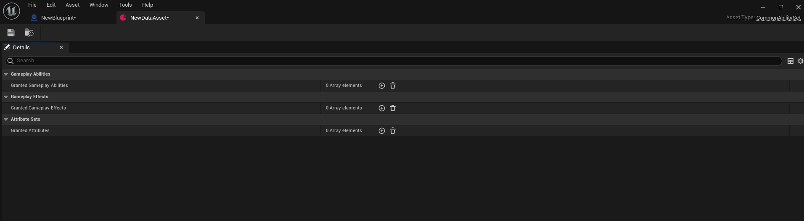

## What is Ability Set?
Gameplay Ability Sets allow you define a set of abilities and effects which are given to the target ASC, I use these to apply the default generic abilities a player has, and default generic effects each player will have. These can also be used for things like perks, etc. The other benefit is, they can be added and removed via a simple handle.

Taken from: [thegames.dev](https://www.thegames.dev/?p=89)

## What does Ability Set do?

In [Lyra Game Sample](https://www.unrealengine.com/marketplace/en-US/product/lyra), the ability set is being used to apply what default abilities, default attribute sets and default gameplay effects a character will have on startup. Their method of granting this to the owned character by using ULyraExperienceDefinition, ULyraPawnData, UGameFeatureAction_AddAbilities and ULyraEquipmentDefinitions [Official Documentation](https://docs.unrealengine.com/5.0/en-US/abilities-in-lyra-in-unreal-engine/#ulyraabilityset)

## How does Common GAS apply the ability set?
In Common GAS, the method of granting this ability set to player-controlled character is adding this in their ``ACharacters->ACommonModularCharacter`` blueprint character class CDO under ``CommonGAS->Character->Abilities->AbilitySets``



In c++, you can get a reference to ``UCommonAbilitySet`` and calling ``GiveToAbilitySystem()`` where you need to give it a valid UAbilitySystemComponent reference so it can add it to 
```
UPROPERTY(ReplicatedUsing=OnRep_ActivateAbilities, BlueprintReadOnly, Category = "Abilities")
FGameplayAbilitySpecContainer ActivatableAbilities;
```
for ``Default Character Abilities``, ``Default Gameplay Effects`` will be added to ``FActiveGameplayEffectHandle`` and ``Default Attribute Set`` will be added using AbilitySystemComponent's ``AddAttributeSetSubobject()``





Name                          | Functionality
----------------------------- | ------------------
Granted Gameplay Abilities    | Gameplay abilities to grant when this ability set is granted.
Granted Gameplay Effects      | Gameplay effects to grant when this ability set is granted.
Granted Attributes            | Attribute sets to grant when this ability set is granted.o be applied on startup
