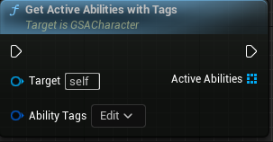
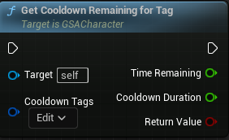
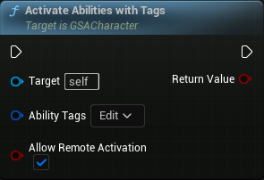
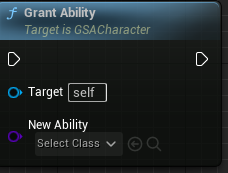
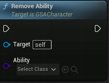
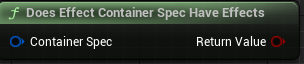
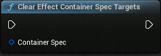
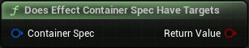
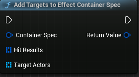
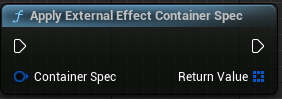

## GetActiveAbilitiesWithTags

Return a list of all active abilities with given ability tags container

Name                          | Types
----------------------------- | ------------------
Ability Tags    (Input)       | Gameplay Tag Container
Active Abilities (Output)     | An array of CommonGameplayAbility 

## GetCooldownRemainingTag

Returns total time and remaining time for cooldown tags. Returns false if no active cooldowns found

Name                          | Types
----------------------------- | ------------------
Cooldown Tags    (Input)      | Gameplay Tag Container
Time Remaining (Output)       | Float 
Cooldown Duration (Output)    | Float 
Return Value (Output)         | Boolean 

## ActivateAbilitiesWithTags
Attempts to activate all abilities that match the specified tags
Returns true if it thinks it activated, but it may return false positives due to failure later in activation.
If bAllowRemoteActivation is true, it will remotely activate local/server abilities, if false it will only try to locally activate the ability

Name                                  | Types
--------------------------------------| ------------------
Ability Tags    (Input)               | Gameplay Tag Container
Allow Remote Activation (Input)       | Boolean 
Return Value (Output)                 | Boolean

## GrantAbility

Grant a gameplay ability to owner Abilitysystemcomponent’s list of active abilities

Name                                  | Types
--------------------------------------| ------------------
New Ability    (Input)                | Gameplay Ability class reference

## RemoveAbility

Remove a gameplay ability from owner Abilitysystemcomponent’s list of active abilities

Name                                  | Types
--------------------------------------| ------------------
Ability    (Input)                    | Gameplay Ability class reference

## DoesEffectContainerSpecHaveEffects

Name                                  | Types
--------------------------------------| ------------------
Container Spec    (Input)             | CommonEffectContainerSpec 
Return Value    (Output)              | Boolean

## ClearEffectContainerSpecTargets

Name                                  | Types
--------------------------------------| ------------------
Container Spec    (Input)             | CommonEffectContainerSpec reference

## DoesEffectContainerSpecHaveTargets

Name                                  | Types
--------------------------------------| ------------------
Container Spec    (Input)             | CommonEffectContainerSpec reference
Return Value    (Output)              | Boolean

## AddTargetsToEffectContainerSpec

Name                                  | Types
--------------------------------------| ------------------
Container Spec    (Input)             | CommonEffectContainerSpec referenc
Hit Results    (Input)                | An array of hit result reference
Target Actors    (Input)              | An array of actor reference
Return Value    (Output)               | CommonEffectContainerSpec

## ApplyExternalEffectContainerSpec

Name                                  | Types
--------------------------------------| ------------------
Container Spec    (Input)             | CommonEffectContainerSpec reference
Return Value    (Output)              | An array of ActiveGameplayEffectHandle reference

