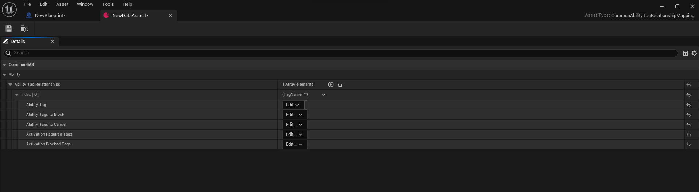
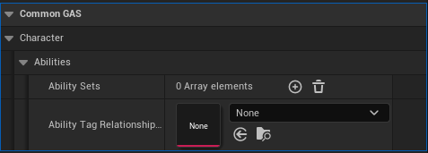

## What is AbilityTagRelationshipMapping?

UAbilityTagRelationshipMapping is a UDataAsset that managed mapping of how ability tags block or cancel other abilities. Without using AbilityTagRelationshipMapping, you have to make your own system by using and overriding UAbilitySystemComponent's 
```

virtual void ApplyAbilityBlockAndCancelTags(const FGameplayTagContainer& AbilityTags, UGameplayAbility* RequestingAbility, bool bEnableBlockTags, const FGameplayTagContainer& BlockTags, bool bExecuteCancelTags, const FGameplayTagContainer& CancelTags) override;

```
and UGameplayAbility 's
```

virtual bool DoesAbilitySatisfyTagRequirements(const UAbilitySystemComponent& AbilitySystemComponent, const FGameplayTagContainer* SourceTags, const FGameplayTagContainer* TargetTags, FGameplayTagContainer* OptionalRelevantTags) const override;

```

## How do we use AbilityTagRelationshipMapping in CommonGAS?
In CommonGAS, you have to make your own AbilityTagRelationshipMapping set and filling all of gameplay tag interactions required for you game

To do this, you need to find ``Miscellaneous-DataAsset`` and choose ``UCommonAbilityTagRelationshipMapping``. After that, you will be greet with this:



To apply this relationship, you need to find your ``ACharacters->ACommonModularCharacter`` blueprint character class CDO under ``CommonGAS->Character->Abilities->AbilityTagRelationshipMapping`` and add your relationship mapping.




## Properties

Name                          | Functionality
----------------------------- | ------------------
AbilityTag                    | The tag that this container relationship is about. Single tag, but abilities can have multiple of these
AbilityTagsToBlock            | The other ability tags that will be blocked by any ability using this tag
AbilityTagsToCancel           | The other ability tags that will be canceled by any ability using this tag
ActivationRequiredTags        | If an ability has the tag, this is implicitly added to the activation required tags of the ability
ActivationBlockedTags         | If an ability has the tag, this is implicitly added to the activation blocked tags of the ability
