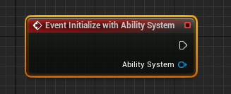
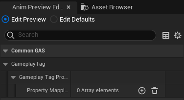
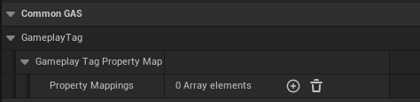
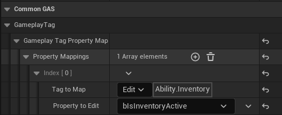

Gameplay Tag Blueprint Property Mapping is a special structure in GAS that can be used in Blueprints to "bind" specific properties. It watches an ASC for tag changes and automatically updates properties on another class.

## Properties

``FGameplayTagPropertyMapping``

The idea is simply that you can set a GameplayTag somewhere and then map it to a variable and then when you access the variable in your anim blueprint, it will match the tag. 

## How Does It Work

1. Create an ``animation blueprint`` class with the parent of ``CommonAnimInstance``.
2. Open your animbp class default and you should see ``GameplayTags->GameplayTagPropertyMap->PropertiesMappings``

3. Now, fill what gameplay tag you want to bind to a specific variable inside your anim bp.

Example:

Now, you should be good to go to manipulate the behaviour of that said variable to suit your need.