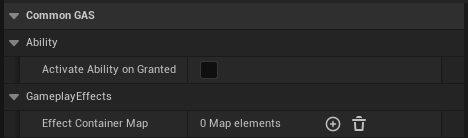
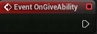
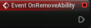

# Common Gameplay Ability

## Class Defaults

Map of gameplay tags to gameplay effect containers and Boolean check if an ability to be granted on granted

Name                          | Types
----------------------------- | ------------------
Effect Container Map          | An array of CommonEffectContainer reference
Activate Ability On Granted   | Boolean

## OnGiveAbility
Called when the ability is given to an AbilitySystemComponent

## OnRemoveAbility
Called when the ability is removed from an AbilitySystemComponent 

## OnAvatarSet
If an ability is marked as 'ActivateAbilityOnGranted', activate them immediately when given here

