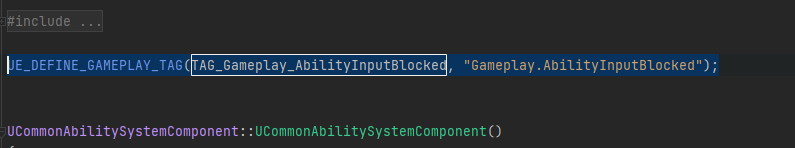

## What is Native Gameplay Tag?
Native tag is a way for add/use Gameplay Tags inside C++  and Blueprint and there are many ways you can do this.
Unreal Engine has a very nice base struct we can utilize for this purpose, and we can make our own derived struct to handle these tags and provide nice C++ accessors
Source Code:
```
Holds a gameplay tag that was registered during static construction of the module, and will
be unregistered when the module unloads.  Each registration is based on the native tag pointer
so even if two modules register the same tag and one is unloaded, the tag will still be registered
by the other one.
```

## How to Use Native Gameplay Tag?

``NativeGameplayTag.h`` provides these useful definitions:

```
namespace UE::GameplayTags::Private
{
	// Used to prevent people from putting UE_DEFINE_GAMEPLAY_TAG_STATIC and UE_DEFINE_GAMEPLAY_TAG in their headers.
	constexpr bool HasFileExtension(const char* File)
	{
		const char* It = File;
		while (*It)
			++It;
		return It[-1] == 'p' && It[-2] == 'p' && It[-3] == 'c' && It[-4] == '.';
	}
}
```

```
/**
 * Declares a native gameplay tag that is defined in a cpp with UE_DEFINE_GAMEPLAY_TAG to allow other modules or code to use the created tag variable.
 */
#define UE_DECLARE_GAMEPLAY_TAG_EXTERN(TagName) extern FNativeGameplayTag TagName;

```

```
/**
 * Defines a native gameplay tag with a comment that is externally declared in a header to allow other modules or code to use the created tag variable.
 */
#define UE_DEFINE_GAMEPLAY_TAG_COMMENT(TagName, Tag, Comment) FNativeGameplayTag TagName(UE_PLUGIN_NAME, UE_MODULE_NAME, Tag, TEXT(Comment), ENativeGameplayTagToken::PRIVATE_USE_MACRO_INSTEAD); static_assert(UE::GameplayTags::Private::HasFileExtension(__FILE__), "UE_DEFINE_GAMEPLAY_TAG_COMMENT can only be used in .cpp files, if you're trying to share tags across modules, use UE_DECLARE_GAMEPLAY_TAG_EXTERN in the public header, and UE_DEFINE_GAMEPLAY_TAG_COMMENT in the private .cpp");
```

```
/**
 * Defines a native gameplay tag with no comment that is externally declared in a header to allow other modules or code to use the created tag variable.
 */
#define UE_DEFINE_GAMEPLAY_TAG(TagName, Tag) FNativeGameplayTag TagName(UE_PLUGIN_NAME, UE_MODULE_NAME, Tag, TEXT(""), ENativeGameplayTagToken::PRIVATE_USE_MACRO_INSTEAD); static_assert(UE::GameplayTags::Private::HasFileExtension(__FILE__), "UE_DEFINE_GAMEPLAY_TAG can only be used in .cpp files, if you're trying to share tags across modules, use UE_DECLARE_GAMEPLAY_TAG_EXTERN in the public header, and UE_DEFINE_GAMEPLAY_TAG in the private .cpp");
```

```
/**
 * Defines a native gameplay tag such that it's only available to the cpp file you define it in.
 */
#define UE_DEFINE_GAMEPLAY_TAG_STATIC(TagName, Tag) static FNativeGameplayTag TagName(UE_PLUGIN_NAME, UE_MODULE_NAME, Tag, TEXT(""), ENativeGameplayTagToken::PRIVATE_USE_MACRO_INSTEAD); static_assert(UE::GameplayTags::Private::HasFileExtension(__FILE__), "UE_DEFINE_GAMEPLAY_TAG_STATIC can only be used in .cpp files, if you're trying to share tags across modules, use UE_DECLARE_GAMEPLAY_TAG_EXTERN in the public header, and UE_DEFINE_GAMEPLAY_TAG in the private .cpp");

```

First, you need to add ``Abilities/CommonGameplayTags.h`` in your include. There a two ways to use this, 

1. The first way is by using ``UE::GameplayTags::Private``. Using the namespace way, you dont have to declare and putting ``UE_DEFINE_GAMEPLAY_TAG_STATIC`` and ``UE_DEFINE_GAMEPLAY_TAG`` in the header. In the future, we will use this namespace way of using native gameplay tag instead of the struct way as to it is way convenient.

2. The second way is using ``UE_DEFINE_GAMEPLAY_TAG_STATIC`` and ``UE_DEFINE_GAMEPLAY_TAG``.

``UE_DEFINE_GAMEPLAY_TAG_STATIC`` is only to be use inside .cpp files and can only be use in that file.
In my game, i use this static tag for defining movement blocking tag inside my UGameplayAbility class and my UCharacterMovementComponent class to block any movement related abilities.

Code:
```
UE_DEFINE_GAMEPLAY_TAG_STATIC(Static_Movement_Blocked, "Ability.Movement.Blocked");

UOuranosGameplayAbility::UOuranosGameplayAbility()
{
    ActivationBlockedTags.AddTag(Static_Movement_Blocked);
}
```

For ``UE_DEFINE_GAMEPLAY_TAG``, you have to declare it in both header and cpp file. In CommonGAS, we use this for the built-in relationship blocking and canceling system of the AbilityTagRelationshipMaspping

You need to declare `` UE_DECLARE_GAMEPLAY_TAG_EXTERN(TAG_Gameplay_AbilityInputBlocked); `` in you header file:


Then, you need to declare `` UE_DEFINE_GAMEPLAY_TAG(TAG_Gameplay_AbilityInputBlocked, "Gameplay.AbilityInputBlocked"); `` in you cpp file:



Usage:


so, thats how we can use native tag. Right now, CommonGAS is using struct way of using native tag but in the future, we will moving to using namespace way of using native tag. :)
