Class used to perform custom gameplay effect modifier calculations, either via blueprint or native code
This class also handle FGameplayEffectSpec interaction with providing wrappers from that struct to be use alongside MMC

Note:
```
Currently this class is being use with Common Pre_ and Sub_ prefix is because in default MMC, Epic
made a mistake of not making all BlueprintCallable functions const so this class is being use for that

(This will be remove in the future once Epic fix that issue)
```
## C++/Blueprint API

## GetCapturedAttributeMagnitude``

Gets the captured magnitude value for the given Attribute

For this to work correctly, the Attribute needs to be added to the Relevant Attributes to Capture array

C++:

``K2_CommonGetCapturedAttributeMagnitude``

Blueprint:

``CommonGetCapturedAttributeMagnitude``

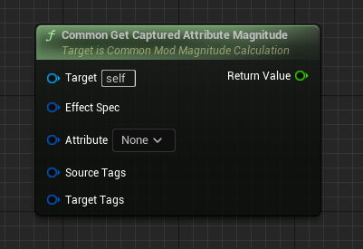

Name                        | Functionality
----------------------------| ------------------
EffectSpec (Input)          | The Gameplay Effect Spec to get the info from
Attribute (Input)           | The attribute to query
Return Value (Output)       | The magnitude value if found, zero otherwise

## GetSetByCallerMagnitudeByTag

Extracts the Set by Caller Magnitude from a Gameplay Effect Spec

C++:

``CommonGetSetByCallerMagnitudeByTag``

Blueprint:

``CommonGetSetByCallerMagnitudeByTag``

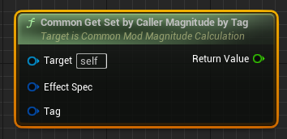

Name                        | Functionality
----------------------------| ------------------
EffectSpec (Input)          | The Gameplay Effect Spec to get the info from
Tag (Input)                 | The effect tag to query
Return Value (Output)       | The magnitude value if found, zero 


## CommonGetSetByCallerMagnitudeByName

Extracts the Set by Caller Magnitude from a Gameplay Effect Spec

C++:

``CommonGetSetByCallerMagnitudeByName``

Blueprint:

``CommonGetSetByCallerMagnitudeByName``

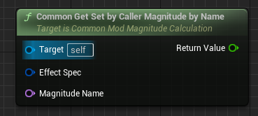

Name                        | Functionality
----------------------------| ------------------
EffectSpec (Input)          | The Gameplay Effect Spec to get the info from
MagnitudeName (Input)       | The effect name to query
Return Value (Output)       | The magnitude value if found, zero 

## CommonGetSourceAggregatedTags


Copies and returns the source aggregated tags from a Gameplay Effect Spec
C++:

``CommonGetSourceAggregatedTags``

Blueprint:

``CommonGetSourceAggregatedTags``

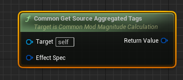

Name                        | Functionality
----------------------------| ------------------
EffectSpec (Input)          | The Gameplay Effect Spec to get the info from
Return Value (Output)       | Gameplay Tag Container with the copied tags. The container will be empty if no captured source tags exist

## CommonGetSourceActorTags

Returns the source actor tags from a Gameplay Effect Spec

C++:

``CommonGetSourceActorTags``

Blueprint:

``CommonGetSourceActorTags``

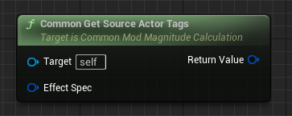

Name                        | Functionality
----------------------------| ------------------
EffectSpec (Input)          | The Gameplay Effect Spec to get the info from
Return Value (Output)       | Gameplay Tag Container with the copied tags. The container will be empty if no captured source tags exist.

## CommonGetTargetAggregatedTags

Copies and returns the target aggregated tags from a Gameplay Effect Spec

C++:

``CommonGetTargetAggregatedTags``

Blueprint:

``CommonGetTargetAggregatedTags``

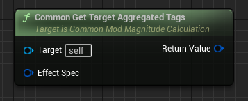

Name                        | Functionality
----------------------------| ------------------
EffectSpec (Input)          | The Gameplay Effect Spec to get the info from
Return Value (Output)       | Gameplay Tag Container with the copied tags. The container will be empty if no captured source tags exist.

## CommonGetTargetActorTags

Returns the target actor tags from a Gameplay Effect Spec
Useful for Modifier Magnitude Calculations

C++:

``CommonGetTargetActorTags``

Blueprint:

``CommonGetTargetActorTags``

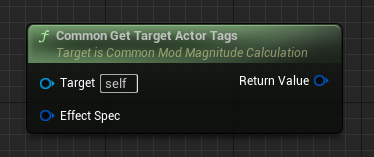

Name                        | Functionality
----------------------------| ------------------
EffectSpec (Input)          | The Gameplay Effect Spec to get the info from
Return Value (Output)       | Gameplay Tag Container with the copied tags. The container will be empty if no captured source tags exist.

## CommonGetTargetSpecTags

Returns the target spec tags from a Gameplay Effect Spec
Useful for Modifier Magnitude Calculations
     
C++:

``CommonGetTargetSpecTags``

Blueprint:

``CommonGetTargetSpecTags``

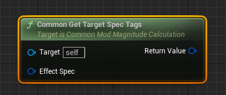

Name                        | Functionality
----------------------------| ------------------
EffectSpec (Input)          | The Gameplay Effect Spec to get the info from
Return Value (Output)       | Gameplay Tag Container with the copied tags. The container will be empty if no captured source tags exist.

## FGameplayEffectSpec

Tells us:

- What UGameplayEffect (const data)
- What Level
- Who instigated

Note:

``I exposed this functionality just so designer can have these functions if they want some speficic modification be done in blueprint but i recommend use FGameplayEffectSpec functions for calculations and modifications in c++ for better control.``

``Its very rarely you need to use some of these functions in blueprint but i exposed them if you ever needed to``

## HasValidCapturedAttributes

Determines if the spec has capture specs with valid captures for all of the specified definitions.

C++:

``HasValidCapturedAttributes``

Blueprint:

``HasValidCapturedAttributes``


Name                         | Functionality
---------------------------- | ---------------
InCaptureDefsToCheck (Input) | Capture definitions to check for
Return Value (Output)        | True if the container has valid capture attributes for all of the specified definitions, false if it does not

## AttemptCalculateDurationFromDef

Helper function to attempt to calculate the duration of the spec from its GE definition

C++:

``AttemptCalculateDurationFromDef``

Blueprint:

``AttemptCalculateDurationFromDef``

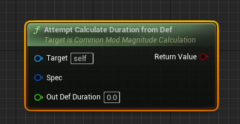

Name                         | Functionality
---------------------------- | ---------------
OutDefDuration (Input)       | Computed duration of the spec from its GE definition; Not the actual duration of the spec
Return Value (Output)        | True if the container has valid capture attributes for all of the specified definitions, false if it does not

## GetSpecDuration

C++:

``GetSpecDuration``

Blueprint:

``GetSpecDuration``

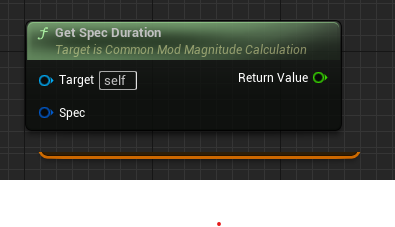

Name                         | Functionality
---------------------------- | ---------------
Spec (Input)                 | FGameplayEffectSpec
Return Value (Output)        | Float

## GetSpecPeriod

C++:

``GetSpecPeriod``

Blueprint:

``GetSpecPeriod``

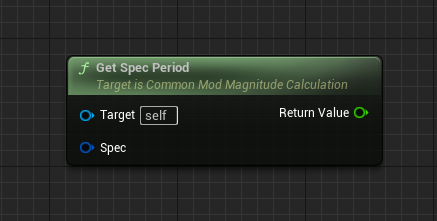

Name                         | Functionality
---------------------------- | ---------------
Spec (Input)                 | FGameplayEffectSpec
Return Value (Output)        | Float

## GetSpecChanceToApplyToTarget

C++:

``GetSpecChanceToApplyToTarget``

Blueprint:

``GetSpecChanceToApplyToTarget``

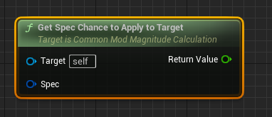

Name                         | Functionality
---------------------------- | ---------------
Spec (Input)                 | FGameplayEffectSpec
Return Value (Output)        | Float

## GetSpecAllGrantedTags

C++:

``GetSpecAllGrantedTags``

Blueprint:

``GetSpecAllGrantedTags``

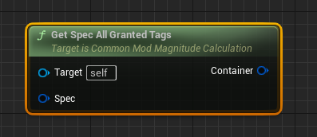

Name                         | Functionality
---------------------------- | ---------------
Spec (Input)                 | FGameplayEffectSpec
Return Value (Output)        | FGameplayEffectContainer

## GetSpecAllBlockedAbilityTags

C++:

``GetSpecAllBlockedAbilityTags``

Blueprint:

``GetSpecAllBlockedAbilityTags``

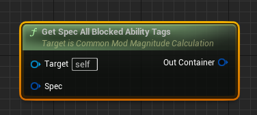

Name                         | Functionality
---------------------------- | ---------------
Spec (Input)                 | FGameplayEffectSpec
Return Value (Output)        | FGameplayEffectContainer

## GetSpecAllAssetTags

C++:

``GetSpecAllAssetTags``

Blueprint:

``GetSpecAllAssetTags``

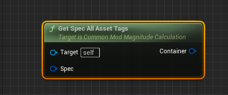

Name                         | Functionality
---------------------------- | ---------------
Spec (Input)                 | FGameplayEffectSpec
Return Value (Output)        | FGameplayEffectContainer

## GetSpecLevel

C++:

``GetSpecLevel``

Blueprint:

``GetSpecLevel``

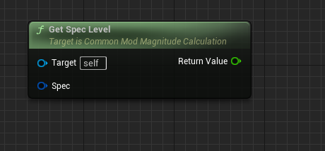

Name                         | Functionality
---------------------------- | ---------------
Spec (Input)                 | FGameplayEffectSpec
Return Value (Output)        | float

## CaptureSpecAttributeDataFromTarget

C++:

``CaptureSpecAttributeDataFromTarget``

Blueprint:

``CaptureSpecAttributeDataFromTarget``

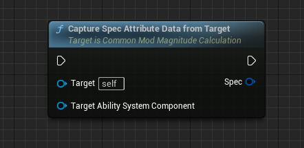

Name                                 | Functionality
-------------------------------------| ---------------
Target AbilitySystemComponent (Input)| UAbilitySystemComponent
Return Value (Output)                | FGameplayEffectSpec

## GetSpecModifierMagnitude

Get the computed magnitude of the modifier on the spec with the specified index

C++:

``GetSpecModifierMagnitude``

Blueprint:

``GetSpecModifierMagnitude``

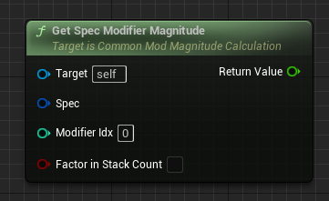

Name                                 | Functionality
-------------------------------------| ---------------
ModifierIndx (Input)                 | Modifier to get
bFactorInStackCount (Input)          | If true, the calculation will include the stack count
Return Value (Output)                | Computed magnitude

## RecaptureSpecSourceActorTags

Recaptures source actor tags of this spec without modifying anything else

C++:

``RecaptureSpecSourceActorTags``

Blueprint:

``RecaptureSpecSourceActorTags``

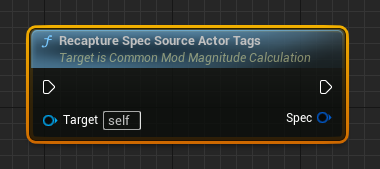

Name                                 | Functionality
-------------------------------------| ---------------
Return Value (Output)                | FGameplayEffectSpec

## SetupSpecAttributeCaptureDefinitions

Helper function to initialize all of the capture definitions required by the spec

C++:

``SetupSpecAttributeCaptureDefinitions``

Blueprint:

``SetupSpecAttributeCaptureDefinitions``

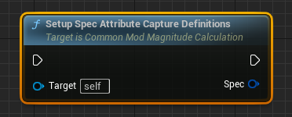

Name                                 | Functionality
-------------------------------------| ---------------
Return Value (Output)                | FGameplayEffectSpec

## CalculateSpecModifiedDuration

Helper function that returns the duration after applying relevant modifiers from the source and target ability system components

C++:

``CalculateSpecModifiedDuration``

Blueprint:

``CalculateSpecModifiedDuration``

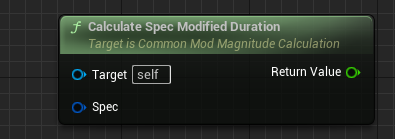

Name                                 | Functionality
-------------------------------------| ---------------
Spec (Input)                         | FGameplayEffectSpec
Return Value (Output)                | Float

## AddDynamicAssetTag

Dynamically add an asset tag not originally from the source GE definition; Added to DynamicAssetTags as well as injected into the captured source spec tags

C++:

``AddDynamicAssetTag``

Blueprint:

``AddDynamicAssetTag``

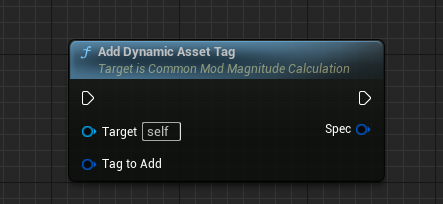

Name                                 | Functionality
-------------------------------------| ---------------
TagToAdd (Input)                     | FGameplayTag
Return Value (Output)                | FGameplayEffectSpec

## AppendDynamicAssetTags

Dynamically append asset tags not originally from the source GE definition; Added to DynamicAssetTags as well as injected into the captured source spec tags

C++:

``AppendDynamicAssetTags``

Blueprint:

``AppendDynamicAssetTags``

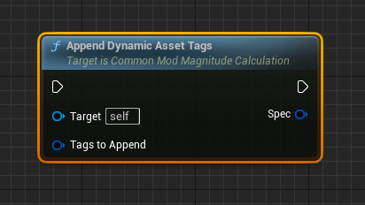

Name                                 | Functionality
-------------------------------------| ---------------
TagToAppend (Input)                     | FGameplayTagContainer
Return Value (Output)                | FGameplayEffectSpec

## GetDynamicAssetTags

C++:

``GetDynamicAssetTags``

Blueprint:

``GetDynamicAssetTags``

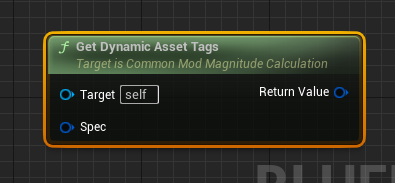

Name                                 | Functionality
-------------------------------------| ---------------
Spec (Input)                         | FGameplayEffectSpec
Return Value (Output)                | FGameplayTagContainer

