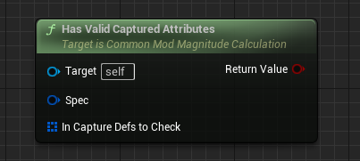

## What is ModMagnitudeCalculation
ModifierMagnitudeCalculations (ModMagCalc or MMC) are powerful classes used as Modifiers in GameplayEffects. They function similarly to GameplayEffectExecutionCalculations but are less powerful and most importantly they can be predicted. Their sole purpose is to return a float value from CalculateBaseMagnitude_Implementation(). You can subclass and override this function in Blueprint and C++.

MMCs can be used in any duration of GameplayEffects - Instant, Duration, Infinite, or Periodic.

MMCs' strength lies in their capability to capture the value of any number of Attributes on the Source or the Target of GameplayEffect with full access to the GameplayEffectSpec to read GameplayTags and SetByCallers. Attributes can either be snapshotted or not. Snapshotted Attributes are captured when the GameplayEffectSpec is created whereas non snapshotted Attributes are captured when the GameplayEffectSpec is applied and automatically update when the Attribute changes for Infinite and Duration GameplayEffects. Capturing Attributes recalculates their CurrentValue from existing mods on the ASC. This recalculation will not run PreAttributeChange() in the AbilitySet so any clamping must be done here again.

Snapshot| Source or Target|Captured on GameplayEffectSpec    |Automatically updates when Attribute changes for Infinite or Duration GE
--------| ----------------|----------------------------------|---------------
Yes     | Source          | Creation                         | No
Yes     | Target          | Application                      | No
No      | Source          | Application                      | Yes
No      | Target          | Application                      | Yes

The resultant float from an MMC can further be modified in the GameplayEffect's Modifier by a coefficient and a pre and post coefficient addition.

An example MMC that captures the Target's mana Attribute reduces it from a poison effect where the amount reduced changes depending on how much mana the Target has and a tag that the Target might have:

```

UPAMMC_PoisonMana::UPAMMC_PoisonMana()
{

	//ManaDef defined in header FGameplayEffectAttributeCaptureDefinition ManaDef;
	ManaDef.AttributeToCapture = UPAAttributeSetBase::GetManaAttribute();
	ManaDef.AttributeSource = EGameplayEffectAttributeCaptureSource::Target;
	ManaDef.bSnapshot = false;

	//MaxManaDef defined in header FGameplayEffectAttributeCaptureDefinition MaxManaDef;
	MaxManaDef.AttributeToCapture = UPAAttributeSetBase::GetMaxManaAttribute();
	MaxManaDef.AttributeSource = EGameplayEffectAttributeCaptureSource::Target;
	MaxManaDef.bSnapshot = false;

	RelevantAttributesToCapture.Add(ManaDef);
	RelevantAttributesToCapture.Add(MaxManaDef);
}

float UPAMMC_PoisonMana::CalculateBaseMagnitude_Implementation(const FGameplayEffectSpec & Spec) const
{
	// Gather the tags from the source and target as that can affect which buffs should be used
	const FGameplayTagContainer* SourceTags = Spec.CapturedSourceTags.GetAggregatedTags();
	const FGameplayTagContainer* TargetTags = Spec.CapturedTargetTags.GetAggregatedTags();

	FAggregatorEvaluateParameters EvaluationParameters;
	EvaluationParameters.SourceTags = SourceTags;
	EvaluationParameters.TargetTags = TargetTags;

	float Mana = 0.f;
	GetCapturedAttributeMagnitude(ManaDef, Spec, EvaluationParameters, Mana);
	Mana = FMath::Max<float>(Mana, 0.0f);

	float MaxMana = 0.f;
	GetCapturedAttributeMagnitude(MaxManaDef, Spec, EvaluationParameters, MaxMana);
	MaxMana = FMath::Max<float>(MaxMana, 1.0f); // Avoid divide by zero

	float Reduction = -20.0f;
	if (Mana / MaxMana > 0.5f)
	{
		// Double the effect if the target has more than half their mana
		Reduction *= 2;
	}
	
	if (TargetTags->HasTagExact(FGameplayTag::RequestGameplayTag(FName("Status.WeakToPoisonMana"))))
	{
		// Double the effect if the target is weak to PoisonMana
		Reduction *= 2;
	}
	
	return Reduction;
}

```
If you don't add the FGameplayEffectAttributeCaptureDefinition to RelevantAttributesToCapture in the MMC's constructor and try to capture Attributes, you will get an error about a missing Spec while capturing. If you don't need to capture Attributes, then you don't have to add anything to RelevantAttributesToCapture.

[GASDocumentation](https://github.com/tranek/GASDocumentation#concepts-ge-mmc)

Note:
```
Currently this class is being use with Common Pre_ and Sub_ prefix is because in default MMC, Epic
made a mistake of not making all BlueprintCallable functions const so this class is being use for that

(This will be remove in the future once Epic fix that issue)
```
## C++/Blueprint API

## GetCapturedAttributeMagnitude``

Gets the captured magnitude value for the given Attribute

For this to work correctly, the Attribute needs to be added to the Relevant Attributes to Capture array

C++:

``K2_CommonGetCapturedAttributeMagnitude``

Blueprint:

``CommonGetCapturedAttributeMagnitude``


Name                        | Functionality
----------------------------| ------------------
EffectSpec (Input)          | The Gameplay Effect Spec to get the info from
Attribute (Input)           | The attribute to query
Return Value (Output)       | The magnitude value if found, zero otherwise

## GetSetByCallerMagnitudeByTag

Extracts the Set by Caller Magnitude from a Gameplay Effect Spec

C++:

``CommonGetSetByCallerMagnitudeByTag``

Blueprint:

``CommonGetSetByCallerMagnitudeByTag``


Name                        | Functionality
----------------------------| ------------------
EffectSpec (Input)          | The Gameplay Effect Spec to get the info from
Tag (Input)                 | The effect tag to query
Return Value (Output)       | The magnitude value if found, zero 


## CommonGetSetByCallerMagnitudeByName

Extracts the Set by Caller Magnitude from a Gameplay Effect Spec

C++:

``CommonGetSetByCallerMagnitudeByName``

Blueprint:

``CommonGetSetByCallerMagnitudeByName``


Name                        | Functionality
----------------------------| ------------------
EffectSpec (Input)          | The Gameplay Effect Spec to get the info from
MagnitudeName (Input)       | The effect name to query
Return Value (Output)       | The magnitude value if found, zero 

## CommonGetSourceAggregatedTags


Copies and returns the source aggregated tags from a Gameplay Effect Spec
C++:

``CommonGetSourceAggregatedTags``

Blueprint:

``CommonGetSourceAggregatedTags``


Name                        | Functionality
----------------------------| ------------------
EffectSpec (Input)          | The Gameplay Effect Spec to get the info from
Return Value (Output)       | Gameplay Tag Container with the copied tags. The container will be empty if no captured source tags exist

## CommonGetSourceActorTags

Returns the source actor tags from a Gameplay Effect Spec

C++:

``CommonGetSourceActorTags``

Blueprint:

``CommonGetSourceActorTags``


Name                        | Functionality
----------------------------| ------------------
EffectSpec (Input)          | The Gameplay Effect Spec to get the info from
Return Value (Output)       | Gameplay Tag Container with the copied tags. The container will be empty if no captured source tags exist.

## CommonGetTargetAggregatedTags

Copies and returns the target aggregated tags from a Gameplay Effect Spec

C++:

``CommonGetTargetAggregatedTags``

Blueprint:

``CommonGetTargetAggregatedTags``


Name                        | Functionality
----------------------------| ------------------
EffectSpec (Input)          | The Gameplay Effect Spec to get the info from
Return Value (Output)       | Gameplay Tag Container with the copied tags. The container will be empty if no captured source tags exist.

## CommonGetTargetActorTags

Returns the target actor tags from a Gameplay Effect Spec
Useful for Modifier Magnitude Calculations

C++:

``CommonGetTargetActorTags``

Blueprint:

``CommonGetTargetActorTags``


Name                        | Functionality
----------------------------| ------------------
EffectSpec (Input)          | The Gameplay Effect Spec to get the info from
Return Value (Output)       | Gameplay Tag Container with the copied tags. The container will be empty if no captured source tags exist.

## CommonGetTargetSpecTags

Returns the target spec tags from a Gameplay Effect Spec
Useful for Modifier Magnitude Calculations
     
C++:

``CommonGetTargetSpecTags``

Blueprint:

``CommonGetTargetSpecTags``


Name                        | Functionality
----------------------------| ------------------
EffectSpec (Input)          | The Gameplay Effect Spec to get the info from
Return Value (Output)       | Gameplay Tag Container with the copied tags. The container will be empty if no captured source tags exist.

## FGameplayEffectSpec

Tells us:

- What UGameplayEffect (const data)
- What Level
- Who instigated

Note:

``I exposed this functionality just so designer can have these functions if they want some speficic modification be done in blueprint but i recommend use FGameplayEffectSpec functions for calculations and modifications in c++ for better control.``

``Its very rarely you need to use some of these functions in blueprint but i exposed them if you ever needed to``

## HasValidCapturedAttributes

Determines if the spec has capture specs with valid captures for all of the specified definitions.

C++:

``HasValidCapturedAttributes``

Blueprint:

``HasValidCapturedAttributes``



Name                         | Functionality
---------------------------- | ---------------
InCaptureDefsToCheck (Input) | Capture definitions to check for
Return Value (Output)        | True if the container has valid capture attributes for all of the specified definitions, false if it does not

## AttemptCalculateDurationFromDef

Helper function to attempt to calculate the duration of the spec from its GE definition

C++:

``AttemptCalculateDurationFromDef``

Blueprint:

``AttemptCalculateDurationFromDef``


Name                         | Functionality
---------------------------- | ---------------
OutDefDuration (Input)       | Computed duration of the spec from its GE definition; Not the actual duration of the spec
Return Value (Output)        | True if the container has valid capture attributes for all of the specified definitions, false if it does not

## GetSpecDuration

C++:

``GetSpecDuration``

Blueprint:

``GetSpecDuration``


Name                         | Functionality
---------------------------- | ---------------
Spec (Input)                 | FGameplayEffectSpec
Return Value (Output)        | Float

## GetSpecPeriod

C++:

``GetSpecPeriod``

Blueprint:

``GetSpecPeriod``


Name                         | Functionality
---------------------------- | ---------------
Spec (Input)                 | FGameplayEffectSpec
Return Value (Output)        | Float

## GetSpecChanceToApplyToTarget

C++:

``GetSpecChanceToApplyToTarget``

Blueprint:

``GetSpecChanceToApplyToTarget``


Name                         | Functionality
---------------------------- | ---------------
Spec (Input)                 | FGameplayEffectSpec
Return Value (Output)        | Float

## GetSpecAllGrantedTags

C++:

``GetSpecAllGrantedTags``

Blueprint:

``GetSpecAllGrantedTags``


Name                         | Functionality
---------------------------- | ---------------
Spec (Input)                 | FGameplayEffectSpec
Return Value (Output)        | FGameplayEffectContainer

## GetSpecAllBlockedAbilityTags

C++:

``GetSpecAllBlockedAbilityTags``

Blueprint:

``GetSpecAllBlockedAbilityTags``


Name                         | Functionality
---------------------------- | ---------------
Spec (Input)                 | FGameplayEffectSpec
Return Value (Output)        | FGameplayEffectContainer

## GetSpecAllAssetTags

C++:

``GetSpecAllAssetTags``

Blueprint:

``GetSpecAllAssetTags``


Name                         | Functionality
---------------------------- | ---------------
Spec (Input)                 | FGameplayEffectSpec
Return Value (Output)        | FGameplayEffectContainer

## GetSpecLevel

C++:

``GetSpecLevel``

Blueprint:

``GetSpecLevel``


Name                         | Functionality
---------------------------- | ---------------
Spec (Input)                 | FGameplayEffectSpec
Return Value (Output)        | float

## CaptureSpecAttributeDataFromTarget

C++:

``CaptureSpecAttributeDataFromTarget``

Blueprint:

``CaptureSpecAttributeDataFromTarget``


Name                                 | Functionality
-------------------------------------| ---------------
Target AbilitySystemComponent (Input)| UAbilitySystemComponent
Return Value (Output)                | FGameplayEffectSpec

## GetSpecModifierMagnitude

Get the computed magnitude of the modifier on the spec with the specified index

C++:

``GetSpecModifierMagnitude``

Blueprint:

``GetSpecModifierMagnitude``


Name                                 | Functionality
-------------------------------------| ---------------
ModifierIndx (Input)                 | Modifier to get
bFactorInStackCount (Input)          | If true, the calculation will include the stack count
Return Value (Output)                | Computed magnitude

## RecaptureSpecSourceActorTags

Recaptures source actor tags of this spec without modifying anything else

C++:

``RecaptureSpecSourceActorTags``

Blueprint:

``RecaptureSpecSourceActorTags``


Name                                 | Functionality
-------------------------------------| ---------------
Return Value (Output)                | FGameplayEffectSpec

## SetupSpecAttributeCaptureDefinitions

Helper function to initialize all of the capture definitions required by the spec

C++:

``SetupSpecAttributeCaptureDefinitions``

Blueprint:

``SetupSpecAttributeCaptureDefinitions``


Name                                 | Functionality
-------------------------------------| ---------------
Return Value (Output)                | FGameplayEffectSpec

## CalculateSpecModifiedDuration

Helper function that returns the duration after applying relevant modifiers from the source and target ability system components

C++:

``CalculateSpecModifiedDuration``

Blueprint:

``CalculateSpecModifiedDuration``


Name                                 | Functionality
-------------------------------------| ---------------
Spec (Input)                         | FGameplayEffectSpec
Return Value (Output)                | Float

## AddDynamicAssetTag

Dynamically add an asset tag not originally from the source GE definition; Added to DynamicAssetTags as well as injected into the captured source spec tags

C++:

``AddDynamicAssetTag``

Blueprint:

``AddDynamicAssetTag``


Name                                 | Functionality
-------------------------------------| ---------------
TagToAdd (Input)                     | FGameplayTag
Return Value (Output)                | FGameplayEffectSpec

## AppendDynamicAssetTags

Dynamically append asset tags not originally from the source GE definition; Added to DynamicAssetTags as well as injected into the captured source spec tags

C++:

``AppendDynamicAssetTags``

Blueprint:

``AppendDynamicAssetTags``


Name                                 | Functionality
-------------------------------------| ---------------
TagToAppend (Input)                     | FGameplayTagContainer
Return Value (Output)                | FGameplayEffectSpec

## GetDynamicAssetTags

C++:

``GetDynamicAssetTags``

Blueprint:

``GetDynamicAssetTags``


Name                                 | Functionality
-------------------------------------| ---------------
Spec (Input)                         | FGameplayEffectSpec
Return Value (Output)                | FGameplayTagContainer

