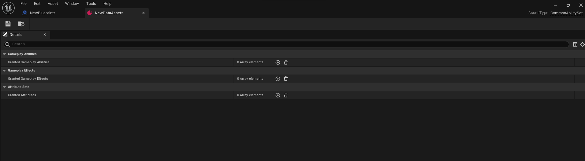

# Common Modular Character

Minimal class that supports extension by game feature plugins

This class is intended to be used by Player-Controlled actors with AbilitySystemComponent living in the PlayerState

## Class Properties

## AbilitySets

An array of UCommonAbilitySet data asset with functionality meant to be applied on startup to ACharacters

Non-mutable data asset used to grant gameplay abilities and gameplay effects.

Name                          | Functionality
----------------------------- | ------------------
Granted Gameplay Abilities    | Gameplay abilities to grant when this ability set is granted.
Granted Gameplay Effects      | Gameplay effects to grant when this ability set is granted.
Granted Attributes            | Attribute sets to grant when this ability set is granted.o be applied on startup

## Ability Tag Relatipship

An array of UAbilityRelationshipMapping data asset with functionality meant to be applied on startup to ACharacters

Mapping of how ability tags block or cancel other abilities

Name                          | Functionality
----------------------------- | ------------------
AbilityTag                    | The tag that this container relationship is about. Single tag, but abilities can have multiple of these
AbilityTagsToBlock            | The other ability tags that will be blocked by any ability using this tag
AbilityTagsToCancel           | The other ability tags that will be canceled by any ability using this tag
ActivationRequiredTags        | If an ability has the tag, this is implicitly added to the activation required tags of the ability
ActivationBlockedTags         | If an ability has the tag, this is implicitly added to the activation blocked tags of the ability

## AbilitySystemComponent

Type: ``UCommonAbilitySystemComponent``

## ReplicationMode

Type: ``EGameplayEffectReplicationMode``

Enabled: ``Mixed``

 How gameplay effects will be replicated to clients 

 Name                          | Functionality
-------------------------------| ------------------
Minimal                        | Only replicate minimal gameplay effect info. Note: this does not work for Owned AbilitySystemComponents (Use Mixed instead).
Mixed                          | Only replicate minimal gameplay effect info to simulated proxies but full info to owners and autonomous proxies
Full                           | Replicate full gameplay info to all

