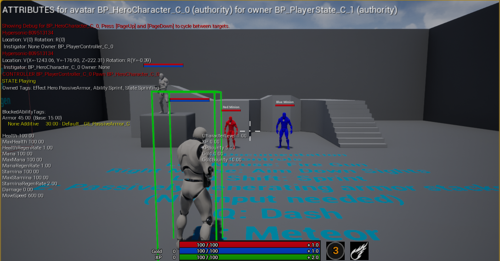
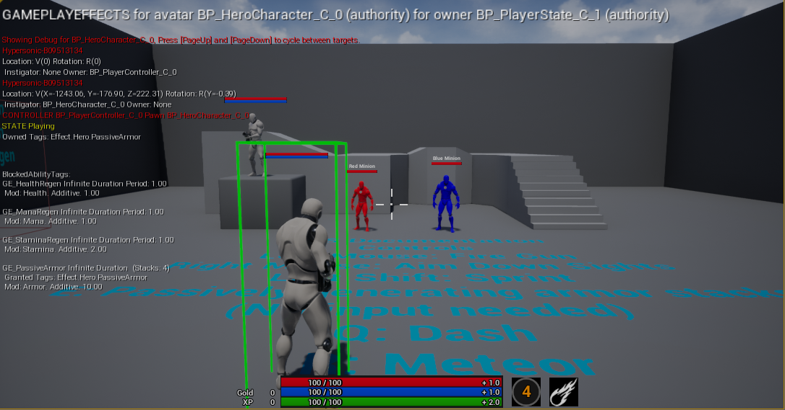
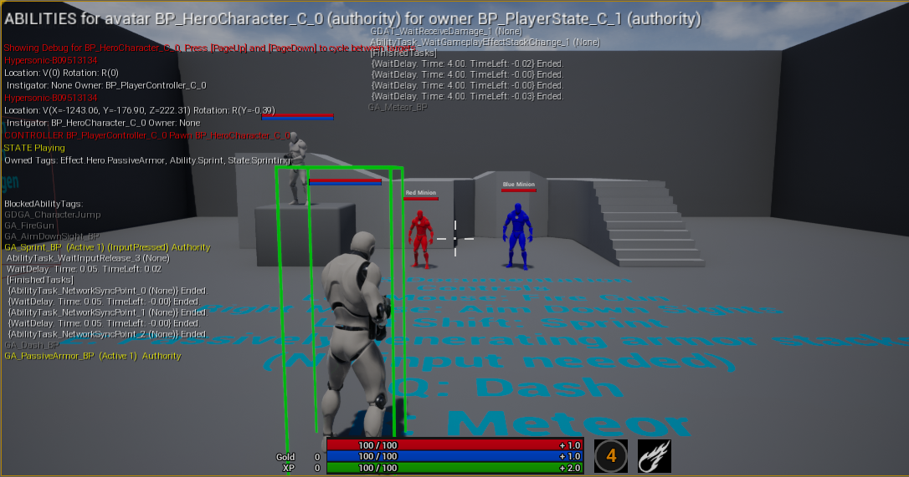

By default, GAS comes with useful console commands you can use to debug your gameplay

## showdebug abilitysystem

``showdebug abilitysystem`` mainly use for opening and closing the gameplay debugger in runtime

## AbilitySystem.Debug

``AbilitySystem.Debug.NextCategory``

``AbilitySystem.Debug.NextCategory`` cycles betwen pages of GAS debugger

1. The first page shows the ``CurrentValue`` of all of your Attributes: 

2. The second page shows all of the ``Duration`` and ``Infinite GameplayEffects`` on you, their number of stacks, what ``GameplayTags`` they give, and what ``Modifiers`` they give. 

3. The third page shows all of the GameplayAbilities that have been granted to you, whether they are currently running, whether they are blocked from activating, and the status of currently running AbilityTasks. 

``AbilitySystem.Debug.NextTarget / AbilitySystem.Debug.PrevTarget``

``AbilitySystem.Debug.NextTarget / AbilitySystem.Debug.PrevTarget``allow you to debug all available ``AbilitySystemComponent`` in the world and switch to the ``next`` or ``previous`` target of said ASC

[GASDocumentation](https://github.com/tranek/GASDocumentation#6-debugging-gas)