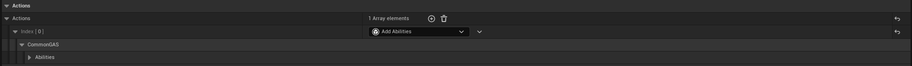
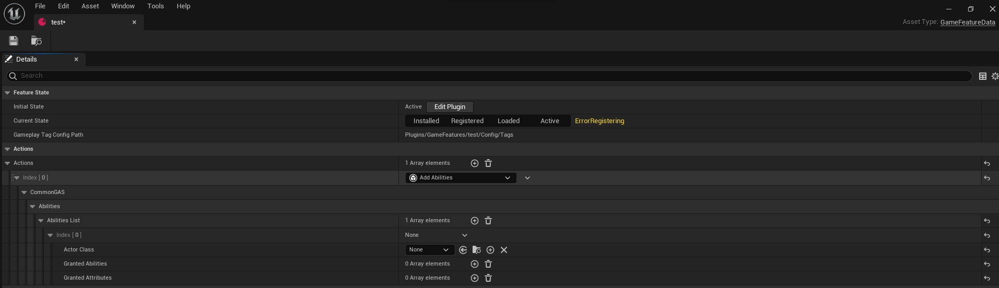
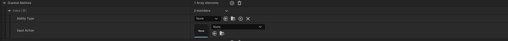
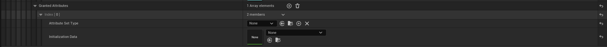

GameFeatureAction ``Add Abilities``responsibles for granting abilities and gameplay effects to actors of a specified type when a game feature is enabled and removing abilities and gameplay effects when a game features is disabled.

Name                                        | Functionality
--------------------------------------------| ------------------
Granted Abilities                    | Applying a gameplay ability with an input action to apply with specified actor
Granted Attribute                    | Applying a attribute set with an data table to initialize gameplay attributes with specified actor

## Granted Abilities

Name                            | Functionality
--------------------------------| ------------------
Ability Type                    | UGameplayAbility to apply
Input Action                    | UInputAction to apply

## Granted Attributes

Name                            | Functionality
--------------------------------| ------------------
Attribute Set Type              | UAttributeSet to grant
Initialization Data             | Data table reference to initialize attributes with