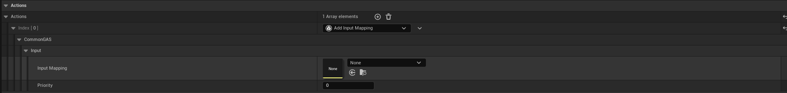

``AddInputMappingContext`` adds ``InputMappingContext`` to local players' EnhancedInput system when a game feature is enabled and remove ``InputMappingContext`` when a game feature is disabled. 

``AddInputMappingContext`` also work in tandem with ``Add Abilities`` game feature action when an Ability is granted alongside an Input Action

Name                        | Functionality
----------------------------| ------------------
Input Mapping               | Input Mapping Context to apply
Priority                    | Higher priority InputMappingContext will be prioritized instead of lower priority Input Mapping Context
