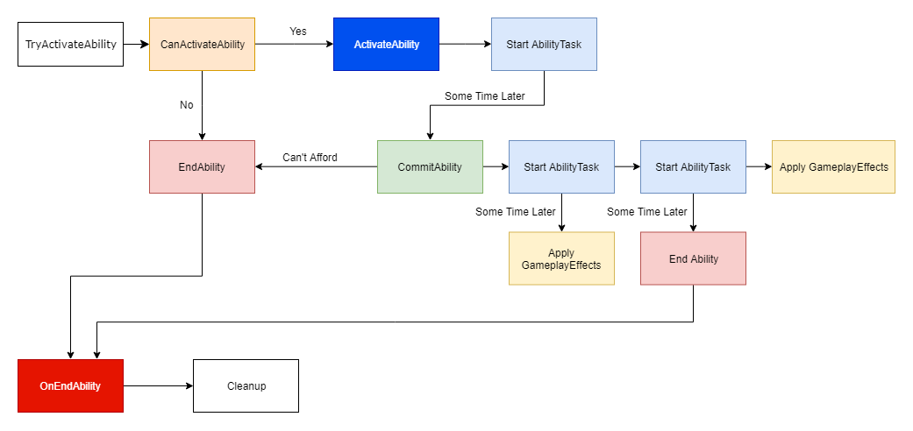

#What is a Gameplay Ability?

A Gameplay Ability is an ingame action that an Actor can own and trigger repeatedly. Common examples include spells, special attacks, or effects triggered by items. This concept is very common in video games, so much so it is often taken for granted, though the processes involved in running an ability are often complex and require specific timing. For example, while coding an attack activation is fairly simple in itself, over the course of a long-term project the complexity of building abilities can explode as you add resource costs, buff or debuff effects to add or remove from players, combo systems, and other details. As such, there are three major considerations involved in how Unreal Engine's Gameplay Ability System is designed. 

GameplayAbilities run on the owning client and/or the server depending on the Net Execution Policy but not simulated proxies. The Net Execution Policy determines if a GameplayAbility will be locally predicted. They include default behavior for optional cost and cooldown GameplayEffects. GameplayAbilities use AbilityTasks for actions that happen over time like waiting for an event, waiting for an attribute change, waiting for players to choose a target, or moving a Character with Root Motion Source. Simulated clients will not run GameplayAbilities. Instead, when the server runs the ability, anything that visually needs to play on the simulated proxies (like animation montages) will be replicated or RPC'd through AbilityTasks or GameplayCues for cosmetic things like sounds and particles.

All GameplayAbilities will have their ActivateAbility() function overriden with your gameplay logic. Additional logic can be added to EndAbility() that runs when the GameplayAbility completes or is canceled.

Flowchart of a simple GameplayAbility: 


Flowchart of a more complex GameplayAbility: 


[GASDocumentation](https://github.com/tranek/GASDocumentation#concepts-ga)
## Coordinating an Ability's Execution

An ability must be able to interact with multiple different systems during its execution, with specific timing. These interactions can include:

1. Activating animation montages.
2. Taking temporary control of a character's movement.
3. Triggering visual effects.
4. Performing overlap or collision events.
5. Changing characters' stats, either temporarily or permanently.
6. Increasing or decreasing ingame resources.
7. Allowing or blocking the activation of other abilities.
8. Handling cooldowns to restrict ability usage.
9. Getting interrupted by ingame events.
10. Canceling other abilities in-progress.
11. Making major state changes to a character, such as activating a new movement mode.
12. Responding to input in the middle of other interactions.
13. Updating UI elements to show ingame status for abilities. 

```
Depending on how an ability works, it could perform any of these interactions at many different points in time while it is active, including in the middle of animations, and some effects may need to persist after the ability itself completes. 
```

## Handling Abilities and Their Execution

A Gameplay Ability is a Blueprint object that is responsible for executing all of an ability's events, including playing animations, triggering effects, fetching attributes from its owner, and displaying visual effects. 

``Controlling Activation``
You can Activate Gameplay Abilities through four main methods:

1. You can activate an Ability explicitly through Blueprint or C++ code using a Gameplay Ability Handle. This is provided by the Ability System Component when an Ability is granted.

2. Using Gameplay Events. This fires all abilities with a matching Ability Trigger. If you need to abstract your input and decision mechanisms, this method is preferable, as it provides the greatest degree of flexibility.

3. Using Gameplay Effects with matching tags. This fires all abilities with a matching Ability Trigger. This is the preferred method for triggering abilities off of Gameplay Effects. A typical use case would be a Sleep debuff, which triggers an ability that plays a disabled animation and inhibits other game actions.

4. Using Input Codes. These are added to the Ability System Component, and when called they will trigger all Abilities that match. This functions similarly to Gameplay Events. 

TIP:
```
Gameplay Abilities can represent a wide array of ingame actions, and are not limited to powers or spells that players explicitly use. Hit reactions, or the above example of a Sleep animation, are good examples.
```
When you Activate a Gameplay Ability, the system recognizes that ability as being in-progress. It then fires off any code attached to the Activate event, moving through each function and Gameplay Task until you call the Finish function to signal the ability is finished executing. You can attach further code to the On Finished event if you need to do any extra cleanup. You can also Cancel an ability to stop it mid-execution.

Gameplay Abilities use Gameplay Tags to limit execution. All abilities have a list of tags that they add to their owning Actor when they activate, as well as lists of tags that block activation or automatically cancel that ability. While you can manually cancel, block, or allow abilities' execution with your own code, this provides a method that is systemically consistent. 

## Attribute Sets and Attributes

The Gameplay Ability System interacts with Actors mainly through Attribute Sets, which contain Gameplay Attributes. These are numeric, floating point values that can be used in calculations or modified by Gameplay Abilities. These can be used for any purpose you want, but common use-cases include tracking a character's health or hit points, as well as values for a character's core statistics (such as Strength and Intelligence). While you can use basic variables to represent these values, Gameplay Attributes provide several advantages:

1. Attribute Sets provide a consistent, reusable group of attributes that you can build systems around.

2. Gameplay Abilities can access Gameplay Attributes through reflection, making it possible to create simple calculations and effects directly in the Blueprint editor.

3. Gameplay Attributes track their default value, current value, and maximum value separately, making it easier to create temporary modifications (buffs and debuffs) and persistent effects. Gameplay Attributes also replicate their value to all clients, and are safe for local UI visualizations such as enemy health bars. 

For an Actor to use Gameplay Attributes, you must add an Attribute Set to its Ability System Component. After that, the Ability System Component can automatically access the attributes you assigned to the Attribute Set. 

## Handling Gameplay Effects

The Gameplay Ability System uses Gameplay Effects to apply changes to Actors targeted by Gameplay Abilities. These can be one-shot effects, such as applying damage, or persistent effects, such as ongoing poison damage, buffs, and debuffs. In the case of persistent effects, the Gameplay Effect attaches itself to the target Actor until it is removed, and they can be pre-set to have a limited lifetime before they expire and clean themselves up, undoing any changes to the target Actor's Gameplay Attributes.

Gameplay Effects use Gameplay Effect Calculations to handle calculations based on Gameplay Attributes. While you can create simple calculations directly in the Blueprint editor, you can also program custom Effect Calculations that have more complex logic and affect multiple attributes at a time. These are able to process information from both the owning Actor of the Gameplay Ability and the target Actor, so you can concentrate common calculations into one reusable piece of code. 

Taken from : [Official Documentation](https://docs.unrealengine.com/5.1/en-US/understanding-the-unreal-engine-gameplay-ability-system/)