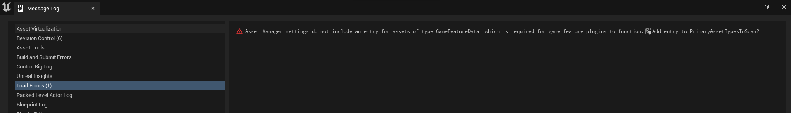

## Installation

## As a project plugin
1. Download the plugin from the [Unreal Engine’s Marketplace](https://www.unrealengine.com/marketplace/en-US/product/common-gas)
2. Navigate to your project folder and create a folder called “plugins”
3. Navigate to your launcher’s version of Unreal Engine folder and copy and paste  the plugin to your “plugins” folder ``C:\Program Files (x86)\Epic Games\UE_Latest\Engine\Plugins\Marketplace``
4. Right click on you ``.uproject`` and generate visual studio project file
5. Click your ``.sln`` and build your project target
6. Start your project
7. Enable it in your project’s plugins by ``Edit->Plugins->CommonGAS``

## As a Engine plugin
1. Download the plugin from the [Unreal Engine’s Marketplace](https://www.unrealengine.com/marketplace/en-US/product/common-gas)
2. Start your Project
3. Enable it in your project’s plugins by ``Edit->Plugins->CommonGAS``

## Opening your project with CommonGAS for the first opening
When you first open your project with CommonGAS enabled, you will see the following message in your message log

Dont panic! This is not an error, this is a validation check from the ``Game Features plugin`` comes by default when you enabled the plugin and since CommonGAS use this plugin for our GameFeatureAction.

Upon clicking the link ``Add entry to PrimaryAssetsTypesToScan?``, you should be prompt with a message to restart the editor.Once your editor is restarted,``DefaultGame.ini`` file will be updated accordingly and those validation errors won't appear anymore.