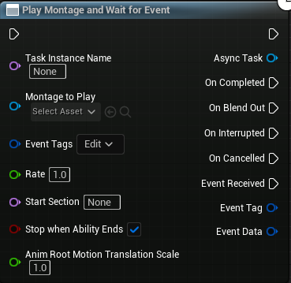

Name                                        | Types
--------------------------------------------| ------------------
Task Instance Name (Input)                  | FName
Montage To Play (Input)                     | UAnimMontage
Event Tags (Input)                          | GameplayTagContainer
Rate (Input)                                | Float
Start Section (Input)                       | FName
Stop when Ability Ends (Input)              | Boolean
Anim Root Motion Translation Scale (Input)  | Float

Name                               | Types
-----------------------------------| ------------------
Async Task (Output)                | 
On Completed (Output)              | The montage completely finished playing 
On Blend Out (Output)              | The montage started blending out
On Interrupted (Output)            | The montage was interrupted  
On Cancelled (Output)              | The ability task was explicitly cancelled by another ability
Event Received (Output)            | One of the triggering gameplay events happened 
Event Tags (Output)                | GameplayTag
Event Data (Output)                | GameplayEventData