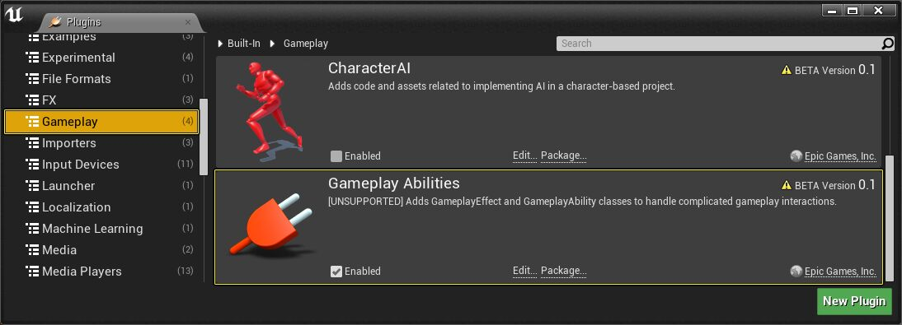
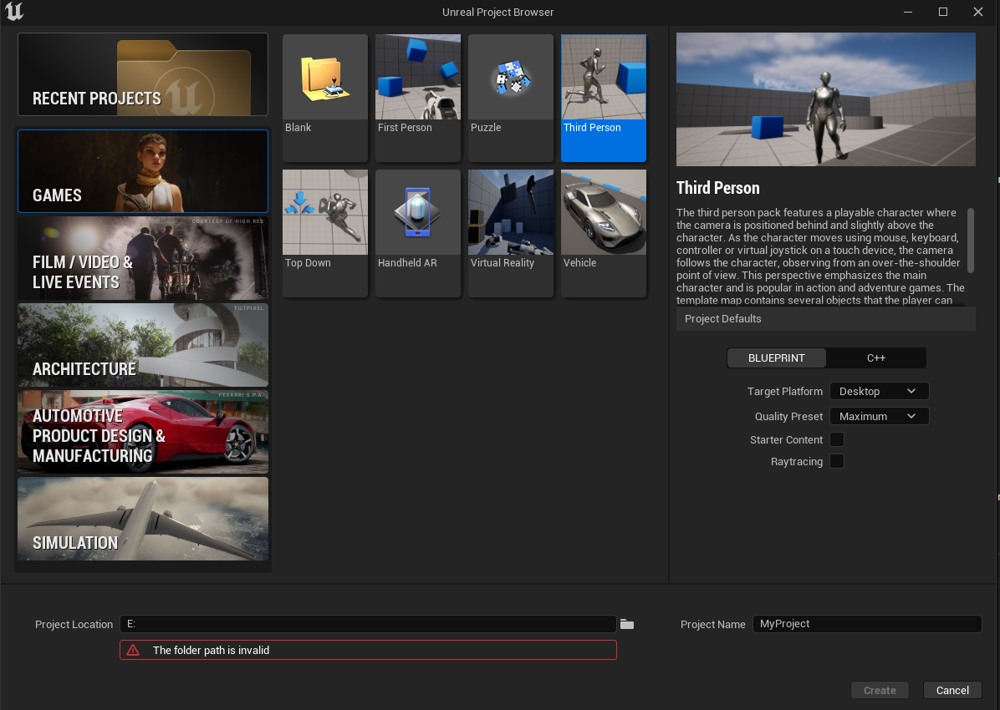
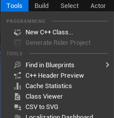
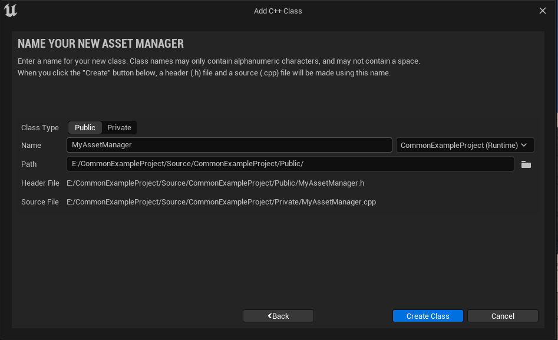
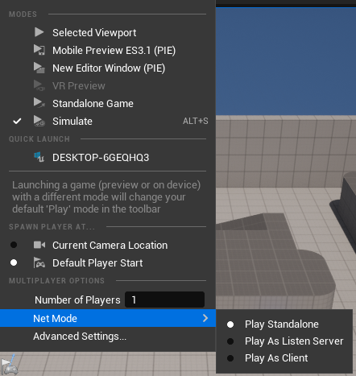
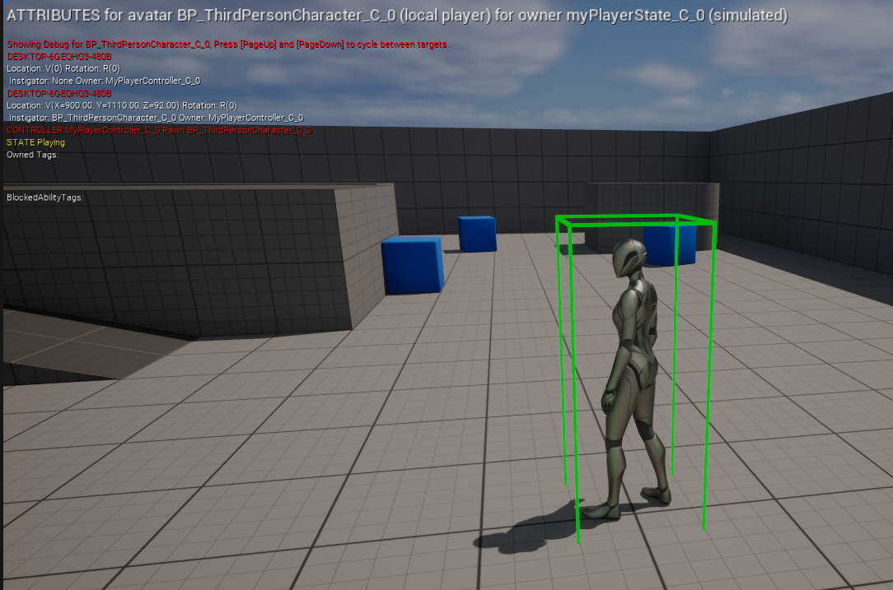
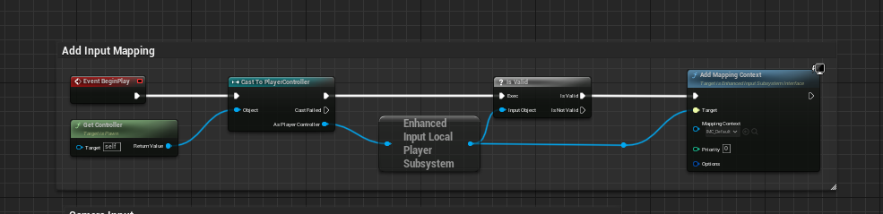
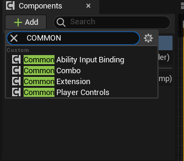
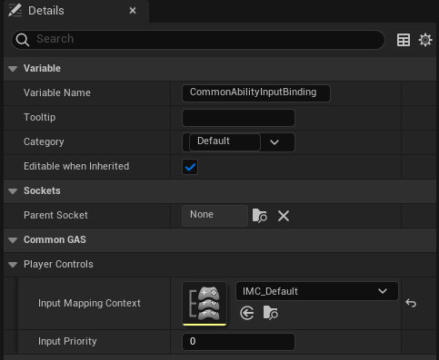
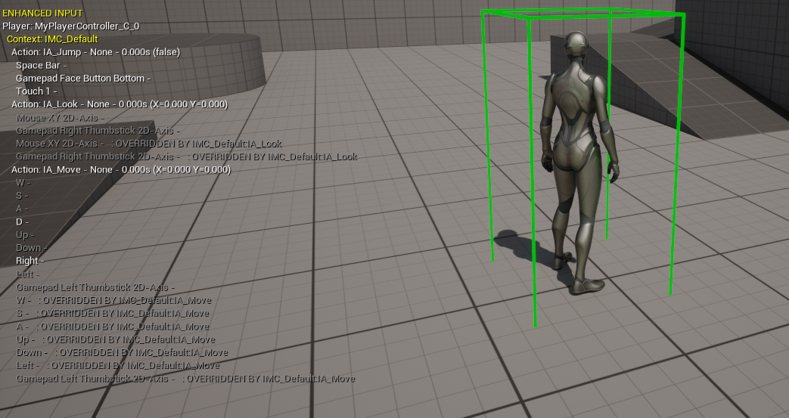

## Prerequisites
1. Enable the Gameplay Ability System Plugin in the Edit -> Plugins window.

2. To get the full range of capabilities of this system, add "GameplayAbilities", "GameplayTags", and "GameplayTasks" to PublicDependencyModuleNames in your project's "(ProjectName).Build.cs" file.

To use the Gameplay Ability System, add the three module names anywhere in the braced list, as follows: 
```
PublicDependencyModuleNames.AddRange(new string[] { "GameplayAbilities", "GameplayTags", "GameplayTasks" });
```
## Setting with a fresh project
In this setup, we will be using the ``Third Person BP template`` for our initial project setup. 

- Create that project by launching the Unreal Engine instance and choose Third Person Project with Blueprint as the project default.


- Set your project location and name your project and create the project.
- Go to ``Tools->New c++ class`` and find ``UAssetManager`` and create your assetmanager.




- Open your IDE and add this code in your header and cpp file.

Header:

```
public:

	static UMyAssetManager& Get();

	/** Starts initial load, gets called from InitializeObjectReferences */
	virtual void StartInitialLoading() override;

```

CPP:

```
#include "AbilitySystemGlobals.h"


UMyAssetManager& UMyAssetManager::Get() 
{
	UMyAssetManager* Singleton = Cast<UMyAssetManager>(GEngine->AssetManager);

	if (Singleton)
	{
		return *Singleton;
	}
	else
	{
		UE_LOG(LogTemp, Fatal, TEXT("Invalid AssetManager in DefaultEngine.ini, must be MyAssetManager!"));
		return *NewObject<UMyAssetManager>();	 // never calls this
	}
}


void UMyAssetManager::StartInitialLoading() 
{
	Super::StartInitialLoading();
	UAbilitySystemGlobals::Get().InitGlobalData();
}
```

Starting in UE 4.24, it is now necessary to call ``UAbilitySystemGlobals::Get().InitGlobalData()`` to use TargetData, otherwise you will get errors related to ``ScriptStructCache`` and clients will be disconnected from the server. This function only needs to be called ``once in a project``. 
Fortnite calls it from ``UAssetManager::StartInitialLoading()`` so thats why we do the same.

- Next, go to your ``Config/DefaultEngine.ini`` and add this into your ``[/Script/Engine.Engine]``
```
[/Script/Engine.Engine]
AssetManagerClassName=/Script/CommonExampleProject.MyAssetManager
```

- Find the ``ThirdPerson`` folder and find your GameMode class. Reparent your game mode class to ``CommonModularGameMode.h`` 
- Find the ``ThirdPerson`` folder and find your Character class. Reparent your character class to ``CommonModularCharacter.h`` 
- Right click, go to blueprint and create a ``PlayerState class``. Reparent your player state class to ``CommonModularPlayerState.h`` 
- Right click, go to blueprint and create a ``PlayerController class``. Reparent your player controller class to ``CommonModularPlayerController.h``

Once you finish, find the three dot near ``Play`` button, find ``NetMode`` and choose ``Play As Client``.




Then, press Play. If we setup everything correctly, we should get no error.
To confirm that, enter this command into the console command ``showdebug abilitysystem`` and you will be greeted with this debug panel.



## Setting up with Preexisting Project


- Go to ``Tools->New c++ class`` and find ``UAssetManager`` and create your assetmanager.


- Open your IDE and add this code in your header and cpp file.

Header:

```
public:

	static UMyAssetManager& Get();

	/** Starts initial load, gets called from InitializeObjectReferences */
	virtual void StartInitialLoading() override;

```

CPP:

```
#include "AbilitySystemGlobals.h"


UMyAssetManager& UMyAssetManager::Get() 
{
	UMyAssetManager* Singleton = Cast<UMyAssetManager>(GEngine->AssetManager);

	if (Singleton)
	{
		return *Singleton;
	}
	else
	{
		UE_LOG(LogTemp, Fatal, TEXT("Invalid AssetManager in DefaultEngine.ini, must be MyAssetManager!"));
		return *NewObject<UMyAssetManager>();	 // never calls this
	}
}


void UMyAssetManager::StartInitialLoading() 
{
	Super::StartInitialLoading();
	UAbilitySystemGlobals::Get().InitGlobalData();
}
```

Starting in UE 4.24, it is now necessary to call ``UAbilitySystemGlobals::Get().InitGlobalData()`` to use TargetData, otherwise you will get errors related to ``ScriptStructCache`` and clients will be disconnected from the server. This function only needs to be called ``once in a project``. 
Fortnite calls it from ``UAssetManager::StartInitialLoading()`` so thats why we do the same.

- Next, go to your ``Config/DefaultEngine.ini`` and add this into your ``[/Script/Engine.Engine]``
```
[/Script/Engine.Engine]
AssetManagerClassName=/Script/CommonExampleProject.MyAssetManager
```

- Reparent your character class to CommonModularCharacter.h
- Reparent your player controller class to CommonModularPlayerController.h
- Reparent your player state class to CommonModularPlayerState.h
- Reparent your game mode class to CommonModularGameMode.h

To see if you configured CommonGAS correctly, go to the command bar and use the following command:

 ``showdebug abilitysystem``


## Using Enhanced Input System 

From Unreal Engine 5.1 onwards, the EnhancedInput plugin will replace the legacy input system. If your project is from Unreal Engine 5.0 and below, make sure to enable the EnhancedInput Plugin by:

``Plugins->Input->EnhancedInput``

By default, the ``Third Person template`` preconfigured to use EnhancedInputSystem and there's some setup configured.


We can just use the preconfigured Binding system on ``BeginPlay`` or using ``CommonAbilityInputBinding`` component.In this setup, we want to use the component as it comes with some convenience functions for input binding.

 - Find your blueprint character class and open it
 - Go to the Component Section and Add the CommonAbilityInputBindingComponent

 

We can delete the ``BeginPlay`` setup and use the component to bind our input mapping context.
The ``Third Person template`` also comes with preconfigured ``InputActions`` and ``InputMappingContext`` in ``ThirdPerson/Input`` folder.

- Find CommonGAS ->PlayerControls category and configure your Mapping Context by using the ``IMC_Default`` that comes with the template



What this component does is essentially the same with what the ``BeginPlay`` event does above.

Note:
```
In the future, im planning to revamp this system so you can configured what IMC when you're enter the Death event and what IMC you will rebind for Death and Respawn system
```
To see if you configure Enhanced Input correctly, go to the command bar and use the following command:

``showdebug enhancedinput``

